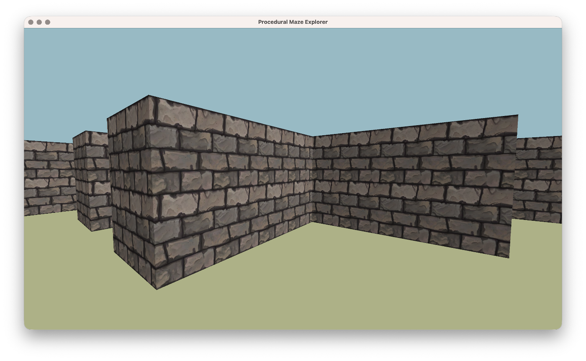

<!-- Procedural Maze Explorer ------------------------------- Jakub Profota --->

<div align="center">
  <h1>Procedural Maze Explorer</h1>

A task for Flying Rat Studio! 🐀
</div>



First-person Vulkan maze explorer with procedural geometry, frustum culling,
textured walls, and a minimap overlay. From the first line of code to the last
line of this readme, the whole thing took ~20 hours of work.

# Build

The best way how to build and run the app is to use the provided `flake.nix` and
its development shell:

```bash
nix develop
cmake -B build -G Ninja
cmake --build build
```

If you are not a Nix user, make sure you have the following dependencies
installed before trying to build:

```bash
clang   # Or any other C++23 capable compiler.
cmake   # Version >= 3.28 due to use of C++23 modules.
glfw
glm
vulkan  # Headers and loader, MoltenVK if you are on MacOS.
slang   # CMake compiles shaders on every build.
```

# Run

Run `./build/flying-rat`. There are no command-line arguments.

Move with `WASD` or arrow keys, look around with mouse, toggle a minimap overlay
with `M`, and quit the app with `Esc`.

# Overview

The app generates a random 21x21 maze at startup using recursive backtracking
and some room carving. A player is spawned at (1, 1) and can move around the
maze. The exit is always the opposite corner of the maze.

Both walls and floors are instanced procedural geometry lit by a single
directional light. Walls are textured. Toggleable centered minimap overlay shows
a visualization of the view frustum, culled tiles, and the start, exit, and
player position.

Although the parameters are not tweakable at runtime, they can be adjusted in
`src/config.cppm` and recompiled. There are many things that can be tweaked,
some of them are shown in the images below.

# Architecture

The total line count is ~3850 of C++ and ~345 of Slang shaders.

```
CMakeLists.txt          # Compilation of C++23 modules and Slang shaders.
flake.nix / flake.lock  # Nix development shell.
data/
  wall.slang            # Textured wall box shader.
  floor.slang           # Floor quad shader.
  minimap.slang         # Minimap overlay shader.
  wall.jpg              # Wall albedo texture.
src/
  main.cpp              # Entry point.
  config.cppm           # Configuration constants.
  maze.cppm             # Maze tiles and layout generation.
  camera.cppm           # Camera.
  player.cppm           # Player and movement input.
  app.cppm              # Window creation and game loop.
  renderer.cppm         # Renderer.
  vulkan/
    core.cpp            # Public functions and frustum culling.
    device.cpp          # Vulkan device and swapchain management.
    pipeline.cpp        # Vulkan pipeline management.
    resources.cpp       # Vulkan resource management.
    texture.cpp         # Texture loading and management.
    minimap.cpp         # Minimap rendering and management.
  vendor/
    stb_image.h         # STB image loader dependency.
```

`App` holds `Maze`, `Player`, and `Renderer`. Only `App` deals with GLFW window
management, and only `Renderer` deals with Vulkan API directly. When the app
starts, a window and Vulkan renderer are initialized. The maze is resized and
generated, the player is spawned, and the game loop begins. Each frame input is
polled, the player is moved, and the renderer draws.

Notable features of the individual components are described below:

## Application

The window size is hardcoded at 1280x720. Delta time is clamped to avoid large
updates. The minimap is toggled on the rising edge of the `M` key. First update
of cursor position does not cause an abrupt jump of the camera view.

## Maze

Start tile is always (1, 1) and the exit is always the opposite corner. `Resize`
forces odd-sized mazes. The recursive backtracker always jumps by 2 tiles in a
random direction. Then, some 3x3 rooms are randomly placed, unless the maze is
too small. Rooms are guaranteed not to be placed at the start or exit.

## Camera

Y-up right-handed coordinate system. Prevents gimbal flips at poles when
rotating.

## Player

The player is always spawned facing the empty tile. The player slides walls on
collision to prevent getting stuck. Collision detection uses a XZ plane circle
below the player's position to detect collisions with wall AABBs.

## Renderer

Descriptor sets are shared across all shaders, but floor and minimap do not use
a texture. Walls and floors outside of view frustum are culled on the CPU. The
walls are also backface culled. The code chooses a swapchain with graphics and
presentation support. It uses 2 swapchain images for double buffering. Minimap
overlay ignores depth testing.

## Shaders

All geometry is procedurally generated. Walls generate side quads, but not the
top nor bottom. The floor is generated as a single quad. The minimap uses a
texture coordinate to set the type of tile to render. It draws a padded
background quad behind the minimap. Walls and floors are instance rendered as
triangle lists. Their orientation is counter-clockwise. Basic directional
lighting is applied.

# Limitations

Swapchain is not recreated on window resize, but the mouse cursor is snapped to
the center of the window and cannot resize anyway. Vulkan validation layers are
not enabled. Configuration constants are hardcoded and require recompilation.
There is no visibility culling, all occluded walls and floors are still
rendered.

<!----------------------------------------------------------------------------->
